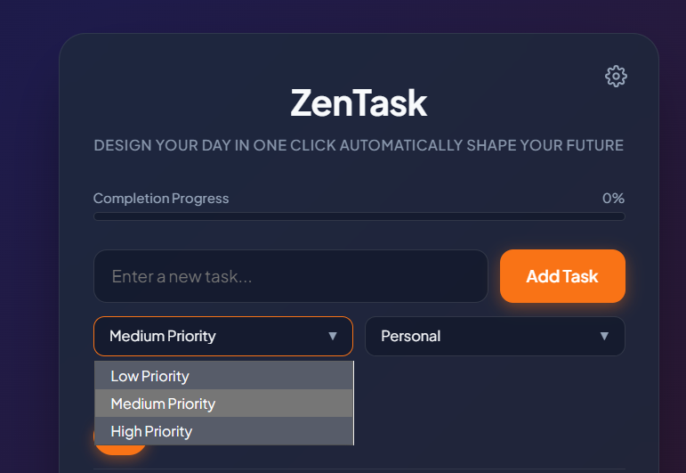
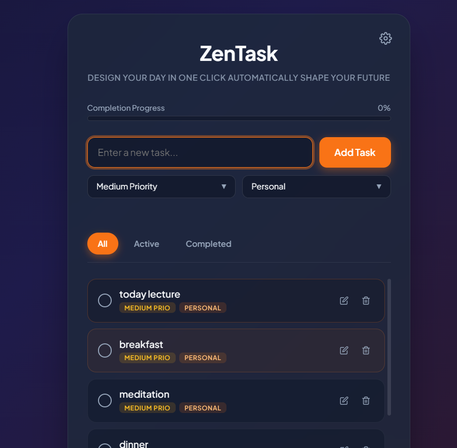
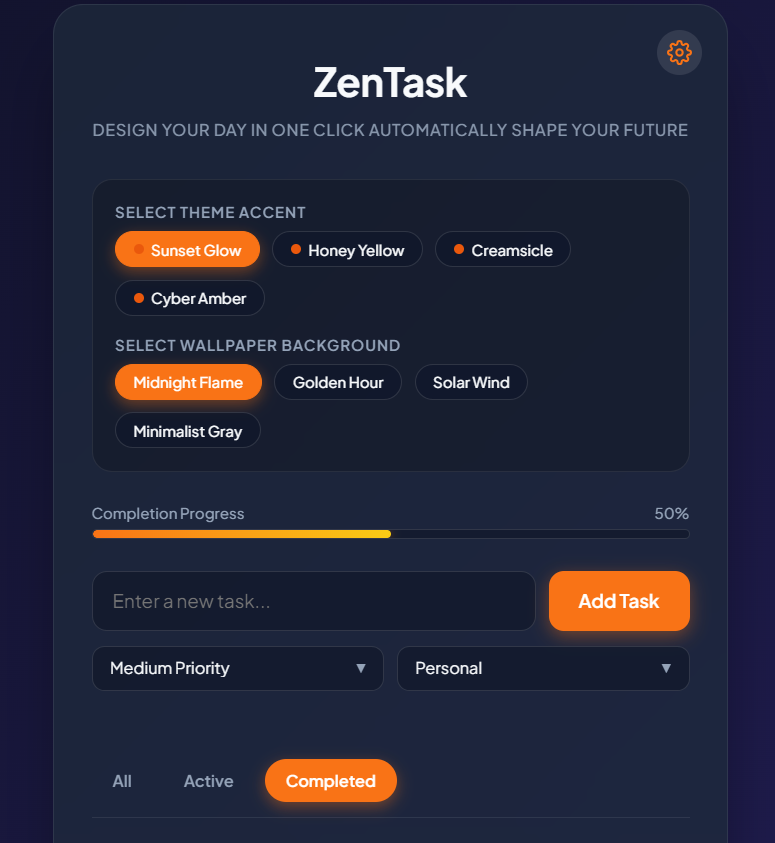
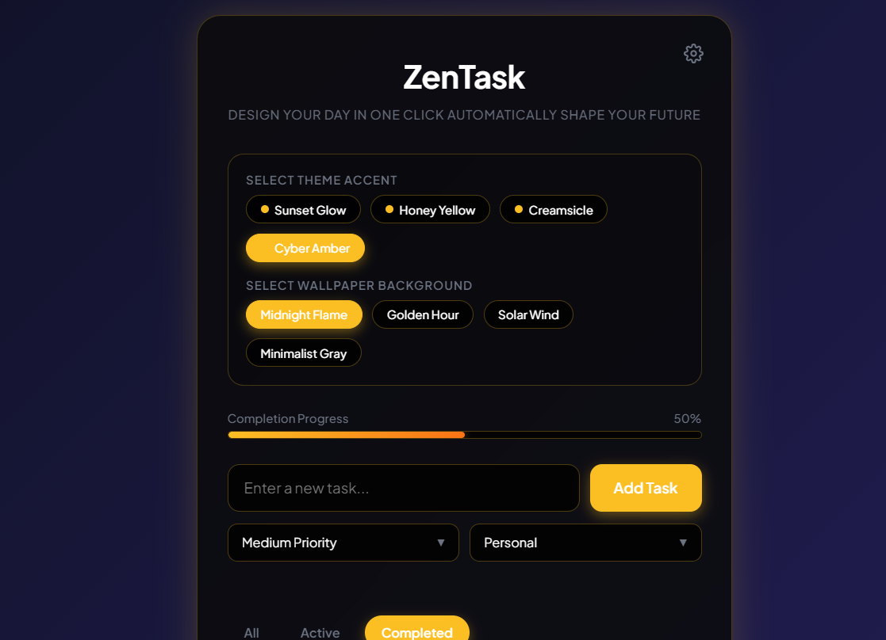

# ZenTask - Premium Themeable To-Do Web App

ZenTask is a modern, high-fidelity, and feature-rich To-Do web application. Designed with elegant glassmorphism aesthetics, fluid gradient backgrounds, and an interactive theme engine specializing in curated, harmonious **yellow and orange** accents.

ZenTask is designed for developers and power-users who want an organized, attractive dashboard to shape their day and track long-term progress.

---

##  Key Features

- ** Multi-Accent Themes**: Switch instantly between carefully chosen visual palettes:
  - **Sunset Glow (Default)**: Deep charcoal dark mode with glowing orange accents.
  - **Honey Yellow**: Clean light mode featuring soft amber accents.
  - **Creamsicle**: Warm, creamy theme with bright orange and soft-peach hues.
  - **Cyber Amber**: High-contrast cyberpunk styling with neon gold accents.
- ** Dynamic Wallpapers**: Instantly transition between fluid gradient environments:
  - *Midnight Flame* (Deep purple & ember gradient)
  - *Golden Hour* (Radiant orange to soft pink gradient)
  - *Solar Wind* (Bright sunny orange gradient)
  - *Minimalist Gray* (Distraction-free, clean neutral background)
- ** Real-time Progress Tracking**: Watch your completion percentage dynamically animate as you add, toggle, or clear tasks.
- ** Multi-Option Metadata**: Categorize tasks and prioritize them to sort your day efficiently:
  - **Priorities**: Low, Medium, High (Color-coded indicators).
  - **Categories**: Personal, Work, Shopping, Goals.
- **Inline Double-Click Editing**: Simply double-click any task name to change its description on the fly, or click the action edit button.
- ** Local Persistence**: Themes, wallpapers, and task items automatically persist inside `localStorage`.
- ** Local JSON Backup**: Export tasks into a clean JSON file and import them back on any device.

---

## Technology Stack

- **Structure**: Semantic HTML5 (SEO friendly)
- **Styling**: Vanilla CSS3 Custom Properties (CSS variables) for real-time dynamic styling, Google Font integration (Plus Jakarta Sans)
- **Logic**: Vanilla ES6+ Javascript (no external frameworks required, lightweight and highly optimized)
- **Assets**: Raw inline SVG icons for fast loading and crisp scaling

---

##  Getting Started

1. Clone or download this repository.
   ```bash
   git clone https://github.com/your-username/todo-list-website.git
   ```
2. Navigate to the project folder:
   ```bash
   cd todo-list-website
   ```
3. Open `todo-list-website/index.html` in any web browser to run ZenTask locally!

---

##  Project Structure

```
todo-list-website/
├── README.md                 # Project Overview & Setup Instructions (This file)
└── todo-list-website/
    ├── index.html            # Main Structure and Settings Panels
    ├── style.css             # Glassmorphism, Theme Variables, and Animations
    └── script.js             # Task Manager Logic, State, and Data Backup
```

---

##  Preview the Aesthetics

- **Themes**: Click the  icon in the top right to customize your workspace accent and wallpaper.
- **Progress**: Complete tasks to see the amber/orange gradient fill the progress track.
- **Edit**: Double-click any task title to modify it inline or use the Edit icon.

---

## todo-list-website







Enjoy designing your day and shaping your future! 
